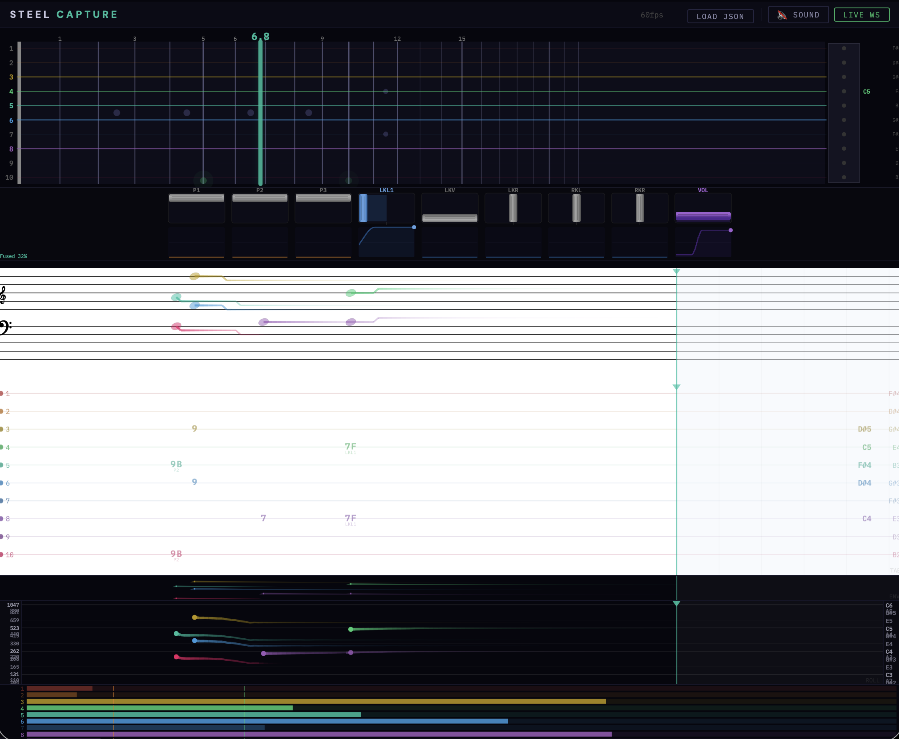

# Steel Capture

Pedal steel guitar expression capture system. Captures pedal/lever/volume state, infers bar position from audio + hall sensors, detects per-string onsets, and streams everything to a browser visualization, OSC targets, or session logs.

**Zero instrument modification.** All sensors attach via velcro, tape, or putty.

> **Status:** Software-only at the moment. The full capture pipeline, simulator, and browser visualization are working. Hardware (Teensy + hall sensors) is still in the experimenting and planning phase.



## Quick Start (Simulator — No Hardware Needed)

```bash
# Install Rust if you haven't already
curl --proto '=https' --tlsv1.2 -sSf https://sh.rustup.rs | sh

# Build (no GUI, works on any platform)
cd steel-capture
cargo build --release --no-default-features

# Run the simulator with browser visualization (algorithmic improv demo)
cargo run --release --no-default-features -- --ws --demo improv

# Open http://localhost:8080 in your browser
```

The `--demo` flag selects the demo sequence: `basic` (short, default), `e9` (90-second scripted tour of the E9 copedant), or `improv` (open-ended algorithmic improvisation with weighted chord progressions and volume expression).

## Build Options

| Command | What you get |
|---------|-------------|
| `cargo build --no-default-features` | Headless (no GUI). Console, WebSocket, OSC, logging. |
| `cargo build` | Native GUI (wry/tao WebView) + everything above. |
| `cargo build --features hardware` | + Serial port support for Teensy 4.1 |
| `cargo build --no-default-features --features calibration` | + Interactive calibration mode (requires cpal) |

## Run Modes

### Native GUI (macOS — default)
```bash
# WebView window with algorithmic improv demo
cargo run --release -- --demo improv

# With external browser access too (--ws opens a second tab)
cargo run --release -- --ws --demo improv

# Headless (no GUI window), browser only
cargo run --release -- --no-gui --ws --demo e9
```

The native GUI uses wry/tao (WKWebView on macOS). It auto-starts the WS server internally; `--ws` additionally allows external browser connections.

### Headless Simulator (development/testing)
```bash
# Browser visualization on localhost:8080
cargo run --release --no-default-features -- --ws --demo improv

# With audio-based string detection (tests the detector against synthetic audio)
cargo run --release --no-default-features -- --ws --detect-strings

# Supply a real WAV file as audio input (auto-enables string detection)
cargo run --release --no-default-features -- --ws --audio-file recording.wav

# Console TUI (no browser needed)
cargo run --release --no-default-features -- --console

# Log session data to disk (JSONL + raw audio)
cargo run --release --no-default-features -- --log-data --output-dir ./sessions

# OSC output (e.g., to Csound, SuperCollider, Max)
cargo run --release --no-default-features -- --osc --osc-target 127.0.0.1:9000

# Combine everything
cargo run --release --no-default-features -- --ws --osc --log-data --console --demo improv
```

### Demo Sequences

| `--demo` value | Description |
|----------------|-------------|
| `basic` | Short ~15-second sequence (default). Exercises pedals, bar slides, vibrato. |
| `e9` | 90-second scripted tour of the E9 copedant. Hits every pedal and lever. |
| `improv` | Open-ended algorithmic improvisation. Weighted chord progressions, volume expression, all 5 levers exercised. Runs until stopped. |

### Hardware (with Teensy + sensors)
```bash
cargo run --release --features hardware -- --port /dev/ttyACM0 --ws --detect-strings
```

### Calibration (requires `calibration` feature)
```bash
# Interactive per-string calibration from live microphone
cargo build --no-default-features --features calibration
cargo run --release --no-default-features --features calibration -- --calibrate

# Calibrate from a WAV file instead of live mic
cargo run --release --no-default-features --features calibration -- --calibrate --audio-file strings.wav

# Use a saved calibration file at runtime
cargo run --release --no-default-features -- --ws --calibration-file calibration.json
```

## Tests

```bash
# Run all tests (47 total: 36 unit + 11 integration)
cargo test --no-default-features

# With hardware feature (60 tests: 49 unit + 11 integration)
cargo test --no-default-features --features hardware

# With calibration feature (51 tests)
cargo test --no-default-features --features calibration

# Just unit tests
cargo test --no-default-features --lib

# Just integration tests
cargo test --no-default-features --test integration
```

### Test Coverage

**Unit tests (36 base, +13 with `hardware` feature):**
- `copedant` (14): MIDI/Hz conversion, open strings, all pedals (A/B/C), all levers (LKL/LKR/LKV/RKL/RKR), partial engagement, combinations (A+C), two-stop lever (RKR soft/hard)
- `bar_sensor` (8): Hall sensor readings at various frets, interpolation accuracy, smoothing, edge cases
- `string_detector` (7): Single string detection, 3-string grip, pedal interaction, silence, no-bar, attack-only-on-onset, release-then-reattack
- `bar_inference` (6): Goertzel frequency detection, sensor-only during silence, fused sensor+audio, pedal interaction, bar lift, silence+no-bar
- `calibration` (1): Config roundtrip
- `serial_reader` (13, `hardware` feature): Frame parsing, CRC validation, sync detection (start, middle, garbage, partial, empty), calibration clamping, channel mapping

**Integration tests (11):**
- Pipeline: basic grip, pedal pitch shift, attack timing, pedal-triggered attacks, silence/no-bar, volume independence
- Audio detection validation against simulator ground truth
- Per-string spectral resolution
- Bar sensor to inference pipeline across frets 0-15
- CaptureFrame + CompactFrame JSON serialization round-trip

**With `calibration` feature (+4):** threshold computation, overlap handling, noisy-signal floor

## Architecture

```
                         ┌──────────────┐
┌─────────────┐     ┌────┤ SerialReader │──┐    ┌─────────────┐
│  Teensy 4.1 │─USB─┤    └──────────────┘  │    │ Console TUI │
│  (sensors)  │     │         OR           │    └──────▲──────┘
└─────────────┘     │    ┌──────────────┐  │    ┌──────┴──────┐
                    └────┤  Simulator   │──┼───▸│  WS Server  │──▸ Browser
                         └──────────────┘  │    └─────────────┘
                              │            │    ┌─────────────┐
                         InputEvent ch.    ├───▸│ OSC Sender  │──▸ Csound
                              │            │    └─────────────┘
                         ┌────▼────────┐   │    ┌─────────────┐
                         │ Coordinator │───┴───▸│ Data Logger │
                         │             │        └─────────────┘
                         │ BarInference│
                         │ StringDetect│
                         │ CopedantEng │
                         └─────────────┘
```

### Key modules

| Module | Purpose |
|--------|---------|
| `types.rs` | Core data types: SensorFrame, AudioChunk, CaptureFrame, Copedant |
| `copedant.rs` | E9 tuning model, pitch computation, bar position inference math |
| `bar_inference.rs` | Fuses hall sensors + Goertzel spectral matching for bar position |
| `bar_sensor.rs` | Hall sensor interpolation (4x SS49E at frets 0/5/10/15) |
| `string_detector.rs` | Per-string onset/release via Goertzel at copedant-derived frequencies |
| `coordinator.rs` | Central pipeline: receives inputs, runs inference, produces CaptureFrames |
| `simulator.rs` | Generates synthetic sensor data + matching audio (sine waves) |
| `ws_server.rs` | Combined HTTP + WebSocket server for browser visualization |
| `osc_sender.rs` | UDP OSC output for DAWs and synthesis environments |
| `data_logger.rs` | Session recording (JSONL frames + raw audio) |
| `console_display.rs` | ASCII terminal dashboard |
| `webview_app.rs` | Native WebView GUI via wry/tao (loads the browser viz) |
| `calibrator.rs` | Interactive per-string calibration from live audio |

### Bar Position Inference

The system infers bar position from audio using the copedant as a constraint:

1. Copedant engine computes each string's expected open pitch given pedal/lever state
2. For each candidate fret position (0.0-24.0 in 0.1 steps), compute expected frequencies
3. Goertzel algorithm measures energy at those frequencies in the audio buffer
4. Best-scoring fret position = bar position. Parabolic refinement for sub-0.1 resolution
5. Fused with hall sensor estimate when available

**Precision:** +/-5 cents = ~0.14mm at fret 3 on a 24" scale. More precise than magnetic sensors.

### Per-String Detection

Because bar position + copedant state tells us the exact Hz of every string, we don't need polyphonic pitch detection. Instead:

1. Compute the 10 expected frequencies from copedant + bar position
2. Goertzel magnitude at each frequency (+ 2nd harmonic for noise rejection)
3. Smoothed energy tracking with hysteresis onset/release thresholds
4. Reports (string_active[10], attacks[10]) per analysis frame

## Hardware (when ready)

See `HARDWARE.md` for the full plan (~$65). Key components:
- Teensy 4.1 ($31.50) — 13 analog inputs at 1kHz
- 13× SS49E hall sensors + neodymium magnets — one per channel
- String detection via software (Goertzel spectral matching, no hardware needed)
- Firmware: `teensy/steel_capture.ino`

## OSC Address Map

| Address | Type | Range | Description |
|---------|------|-------|-------------|
| `/steel/pedal/{a,b,c}` | float | 0-1 | Pedal engagement |
| `/steel/knee/{0..4}` | float | 0-1 | Knee lever (LKL/LKR/LKV/RKL/RKR) |
| `/steel/volume` | float | 0-1 | Volume pedal |
| `/steel/bar/pos` | float | 0-24 | Bar position in frets (-1 = not detected) |
| `/steel/bar/confidence` | float | 0-1 | Inference confidence |
| `/steel/bar/source` | float | 0-3 | 0=none, 1=sensor, 2=audio, 3=fused |
| `/steel/pitch/{0..9}` | float | Hz | Per-string pitch |

## WebSocket Protocol

CompactFrame JSON streamed at `--ws-fps` rate (default 60). Uses short keys to reduce bandwidth (~40% smaller than verbose):

```json
{"t":1234567,"p":[0.0,0.5,1.0],"kl":[0.0,0.0,0.0,0.3,0.0],"v":0.8,"bs":[0.1,0.9,0.2,0.0],"bp":5.0,"bc":0.95,"bx":"Fused","hz":[370.0,311.0,415.0,329.0,247.0,207.0,185.0,164.0,147.0,123.0],"sa":[false,false,true,true,true,false,false,false,false,false],"at":[false,false,true,false,false,false,false,false,false,false],"am":[0.0,0.0,0.8,0.7,0.6,0.0,0.0,0.0,0.0,0.0]}
```

| Key | Full name | Type |
|-----|-----------|------|
| `t` | timestamp_us | u64 |
| `p` | pedals | [f32; 3] |
| `kl` | knee_levers | [f32; 5] |
| `v` | volume | f32 |
| `bs` | bar_sensors | [f32; 4] |
| `bp` | bar_position | f32 or null |
| `bc` | bar_confidence | f32 |
| `bx` | bar_source | "None"/"Sensor"/"Audio"/"Fused" |
| `hz` | string_pitches_hz | [f64; 10] |
| `sa` | string_active | [bool; 10] |
| `at` | attacks | [bool; 10] |
| `am` | string_amplitude | [f32; 10] |

The browser visualization accepts both compact and verbose keys for backward compatibility.

## Session Recording Format

`--log-data` writes JSONL (one JSON object per line):

```
{"format":"steel-capture","rate_hz":60,"copedant":{...},"channels":[...]}
{"t":16667,"p":[0.0,0.0,0.0],"kl":[0.0,0.0,0.0,0.0,0.0],"v":0.7,...}
{"t":33333,"p":[0.0,0.0,0.0],...}
```

First line is a self-describing header with copedant, channel definitions, and sample rate. Each subsequent line is a CompactFrame. The visualization can load `.jsonl` files directly via the "Load File" button.

## CLI Reference

```
steel-capture [OPTIONS]

Input:
      --simulate                Run in simulator mode [default: true]
      --port <PORT>             Serial port for Teensy [default: /dev/ttyACM0]
      --demo <NAME>             Simulator demo: basic, e9, or improv [default: basic]
      --sensor-rate <HZ>        Sensor sample rate [default: 1000]
      --audio-file <PATH>       WAV file as audio input (auto-enables --detect-strings)
      --detect-strings          Use audio-based string detection

Output:
      --ws                      Enable WebSocket server for browser viz
      --ws-addr <ADDR>          WebSocket bind address [default: 0.0.0.0:8080]
      --ws-fps <FPS>            WebSocket broadcast rate [default: 60]
      --no-open                 Suppress auto-opening browser when --ws is active
      --osc                     Enable OSC output
      --osc-target <ADDR>       OSC target address [default: 127.0.0.1:9000]
      --log-data                Enable session logging (JSONL + raw audio)
      --output-dir <DIR>        Session output directory [default: ./sessions]
      --console                 Enable console TUI
      --display-hz <HZ>         Console refresh rate [default: 20]

GUI:
      --no-gui                  Disable native WebView window

Calibration (--features calibration):
      --calibrate               Run interactive per-string calibration
      --calibration-file <PATH> Calibration JSON path [default: calibration.json]
```
